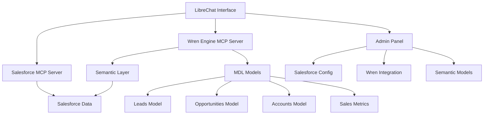

## 1. Product Overview

Build a conversational AI assistant that enables sales teams to interact with Salesforce using natural language. This project integrates Wren Engine as a semantic layer to improve the accuracy of Salesforce querying through the existing Salesforce MCP server in LibreChat.

- **Purpose**: Enhance the existing Salesforce MCP server integration by adding Wren Engine's semantic layer to provide more accurate, context-aware Salesforce data queries and analysis for sales teams.
- **Target Value**: Transform sales team productivity by enabling natural language interactions with Salesforce data, reducing query errors, and providing trusted business calculations through semantic understanding.

## 2. Core Features

### 2.1 User Roles

| Role | Registration Method | Core Permissions |
|------|---------------------|------------------|
| Sales Representative | Standard LibreChat user account | Can query Salesforce data, view leads/opportunities, ask natural language questions about sales metrics |
| Sales Manager | LibreChat user account with manager permissions | Can access team performance data, generate sales reports, analyze pipeline metrics |
| Sales Administrator | LibreChat admin with Salesforce configuration access | Can configure Salesforce connections, manage Wren semantic models, set data access controls |

### 2.2 Feature Module

Our Salesforce-focused Wren Engine integration consists of the following main components:

1. **Wren Engine MCP Server**: Semantic layer server that enhances the existing Salesforce MCP server for improved query accuracy.
2. **Salesforce Semantic Models**: MDL (Model Definition Language) files defining Salesforce objects, relationships, and business calculations.
3. **Enhanced Chat Interface**: Natural language Salesforce querying through LibreChat's existing chat interface with improved semantic understanding.
4. **Sales Analytics**: Pre-built semantic models for common sales metrics, pipeline analysis, and performance tracking.
5. **Configuration Management**: Setup and management of Wren Engine semantic layer for Salesforce data.

### 2.3 Page Details

| Page Name | Module Name | Feature description |
|-----------|-------------|---------------------|
| Chat Interface | Salesforce Query Enhancement | Enable natural language Salesforce queries through existing chat interface. Support semantic understanding of sales terminology, lead/opportunity analysis, and contextual business insights. |
| Admin Configuration | Wren-Salesforce Integration | Configure Wren Engine semantic layer for Salesforce, manage environment variables (WREN_URL, CONNECTION_INFO_FILE, MDL_PATH). Monitor integration health between Wren and Salesforce MCP. |
| Salesforce Model Setup | Semantic Model Management | Configure Wren semantic models for Salesforce objects (Leads, Opportunities, Accounts, Contacts). Define business calculations and sales metrics. |
| Sales Analytics | Dashboard Integration | Pre-built semantic queries for sales performance, pipeline analysis, conversion rates. Support for common sales KPIs and reporting. |
| Query History | Sales Query Tracking | Track Salesforce queries, monitor usage patterns by sales team. Display query accuracy improvements and semantic understanding metrics. |

## 3. Core Process

**Sales Administrator Flow:**
1. Configure Wren Engine semantic layer to enhance existing Salesforce MCP server
2. Set up Salesforce semantic models using MDL files for sales objects
3. Define business calculations for sales metrics and KPIs
4. Configure user access permissions for sales team members
5. Monitor integration health and query accuracy improvements

**Sales Representative Flow:**
1. Access LibreChat chat interface with Salesforce assistant
2. Ask natural language questions about leads, opportunities, and accounts
3. Receive accurate Salesforce data through enhanced semantic understanding
4. Get insights on sales performance and pipeline status
5. Share results with team members and update Salesforce records

**Sales Manager Flow:**
1. Use advanced querying capabilities for team performance analysis
2. Generate sales reports and pipeline forecasts through natural language
3. Analyze conversion rates and sales metrics across the team
4. Create comprehensive sales dashboards and KPI tracking
5. Collaborate with sales reps on data-driven insights

## 4. User Interface Design

### 4.1 Design Style

- **Primary Colors**: LibreChat's existing color scheme (#2563eb blue, #1f2937 dark gray)
- **Secondary Colors**: Wren Engine accent colors (#10b981 green for success states, #f59e0b amber for warnings)
- **Button Style**: Consistent with LibreChat's rounded button design with subtle shadows
- **Font**: Inter font family, 14px base size for readability
- **Layout Style**: Card-based design with clean spacing, integrated seamlessly with LibreChat's existing interface
- **Icons**: Lucide icons for data-related actions (database, chart, table icons)

### 4.2 Page Design Overview

| Page Name | Module Name | UI Elements |
|-----------|-------------|-------------|
| Chat Interface | Salesforce Query Input | Enhanced chat input with Salesforce-specific suggestions, sales terminology recognition, inline Salesforce record previews |
| Admin Configuration | Wren-Salesforce Settings | Configuration forms for Wren integration, Salesforce connection status, semantic layer health indicators |
| Salesforce Model Setup | Semantic Model Editor | MDL editor for Salesforce objects, relationship diagrams for sales entities, validation feedback for business rules |
| Sales Analytics | Dashboard Integration | Pre-built sales widgets, pipeline visualization, KPI cards, Salesforce report integration |
| Query History | Sales Query Tracking | Salesforce query logs, accuracy improvement metrics, sales team usage analytics, query optimization suggestions |

### 4.3 Responsiveness

Desktop-first approach with mobile-adaptive design. Touch interaction optimization for mobile users accessing data insights. Responsive data tables with horizontal scrolling on smaller screens. Collapsible sidebar navigation for admin functions on mobile devices.